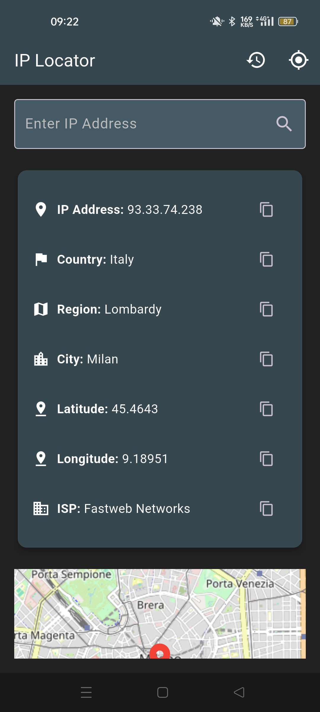

# IP Locator - Flutter App

[](https://github.com/ZanchiSerse/ip_locator/issues)
[](https://github.com/ZanchiSerse/ip_locator/stargazers)
[](https://github.com/ZanchiSerse/ip_locator/network)
[](https://github.com/ZanchiSerse/ip_locator/blob/main/LICENSE) <!-- Aggiungi se hai una licenza -->

**IP Locator** è una semplice applicazione Flutter che permette di localizzare un indirizzo IP fornito dall'utente.  Utilizza un'API esterna per ottenere informazioni geografiche associate all'IP e le visualizza in un'interfaccia utente intuitiva.

![Screenshot dell'applicazione]

## Caratteristiche

*   **Localizzazione IP:** Inserisci un indirizzo IP e ottieni la sua posizione geografica approssimativa.
*   **Visualizzazione Dati:** Visualizza informazioni dettagliate come:
    *   Città
    *   Regione
    *   Paese
    *   Coordinate di Latitudine e Longitudine
    *   Codice Postale
    *   Fuso Orario
*   **Interfaccia Utente Intuitiva:** Design pulito e facile da usare.
*   **Gestione degli Errori:** Gestisce errori di connessione e indirizzi IP non validi.
*   **State Management:** Utilizzo di `Provider` per una gestione efficiente dello stato dell'applicazione.
*   **Salvataggio IP Ricercati:** Memorizza gli IP precedentemente ricercati per un accesso più rapido.

## Tecnologie Utilizzate

*   [Flutter](https://flutter.dev/) - Framework UI per la creazione di applicazioni mobile, web e desktop da un'unica codebase.
*   [Dart](https://dart.dev/) - Linguaggio di programmazione utilizzato da Flutter.
*   [Provider](https://pub.dev/packages/provider) - Package per la gestione dello stato dell'applicazione.
*   [Dio](https://pub.dev/packages/dio) - Client HTTP per effettuare chiamate API.
*   [Shared Preferences](https://pub.dev/packages/shared_preferences) - Package per memorizzare dati semplici in locale (come gli IP ricercati).
*   [dotenv](https://pub.dev/packages/flutter_dotenv) - Package per caricare le variabili d'ambiente da un file `.env`.
*   **API di geolocalizzazione:** (Specificare l'API utilizzata. Esempio:  [ip-api.com](https://www.ip-api.com/))  - Utilizzata per ottenere le informazioni di localizzazione.

## Installazione

1.  **Clona il repository:**

    ```bash
    git clone https://github.com/ZanchiSerse/ip_locator.git
    cd ip_locator
    ```

2.  **Installa le dipendenze:**

    ```bash
    flutter pub get
    ```

3.  **Configura le variabili d'ambiente:**

    *   Crea un file `.env` nella root del progetto.
    *   Aggiungi le variabili d'ambiente necessarie (come la chiave API, se l'API utilizzata la richiede). Esempio:

        ```
        API_KEY=YOUR_API_KEY
        ```

    *   **Importante:** Non committare il file `.env` nel repository! Aggiungilo a `.gitignore`.

4.  **Esegui l'applicazione:**

    ```bash
    flutter run
    ```

## Come Utilizzare

1.  Apri l'applicazione.
2.  Inserisci un indirizzo IP nel campo di testo.
3.  Premi il pulsante "Localizza".
4.  Visualizza le informazioni di localizzazione.
5.  (Opzionale) Controlla la cronologia degli IP ricercati.

## Struttura del Progetto

*   `android/`: Configurazione specifica per Android
*   `ios/`: Configurazione specifica per iOS
*   `lib/`: Codice sorgente dell'applicazione
    *   `main.dart`: Punto di ingresso dell'applicazione
    *   `models/`: Definizioni dei modelli di dati (es: IpInfo)
    *   `providers/`: Gestione dello stato con Provider (es: IpProvider)
    *   `screens/`: Le schermate dell'app (es: HomeScreen, HistoryScreen)
    *   `services/`: Servizi per chiamate API (es: IpService)
    *   `widgets/`: Componenti UI riutilizzabili
*   `.gitignore`: File per ignorare file non necessari nel repository
*   `pubspec.yaml`: File di configurazione del progetto Flutter
*   `README.md`: Questo file

## Contribuire

Se desideri contribuire a questo progetto, sentiti libero di aprire una issue o inviare una pull request. Tutte le contribuzioni sono benvenute!

1.  Fai un fork del repository.
2.  Crea un branch con la tua feature: `git checkout -b feature/mia-feature`
3.  Fai il commit delle tue modifiche: `git commit -m 'Aggiunta nuova feature'`
4.  Fai il push al branch: `git push origin feature/mia-feature`
5.  Apri una pull request.

## Licenza

[MIT](LICENSE) <!-- Sostituisci con la licenza appropriata se ne hai una -->

## Autore

[ZanchiSerse](https://github.com/ZanchiSerse)

## Ringraziamenti

*   Un ringraziamento speciale a [nome del provider API](Indirizzo del sito del provider API) per fornire i dati di localizzazione IP.

---

**Nota:**

*   Aggiungi uno screenshot dell'applicazione per renderla più attraente.
*   Specifica l'API di geolocalizzazione utilizzata nel progetto.
*   Assicurati di includere un file `LICENSE` se desideri specificare una licenza open-source.
*   Aggiorna la sezione "Contribuire" con le linee guida specifiche per il tuo progetto.
*   Considera l'aggiunta di un breve video demo dell'applicazione.
*   Controlla che il percorso dei file nella sezione "Struttura del progetto" sia corretto.
*   Rivedi e adatta il testo per riflettere accuratamente le caratteristiche e lo stato attuale del progetto.
